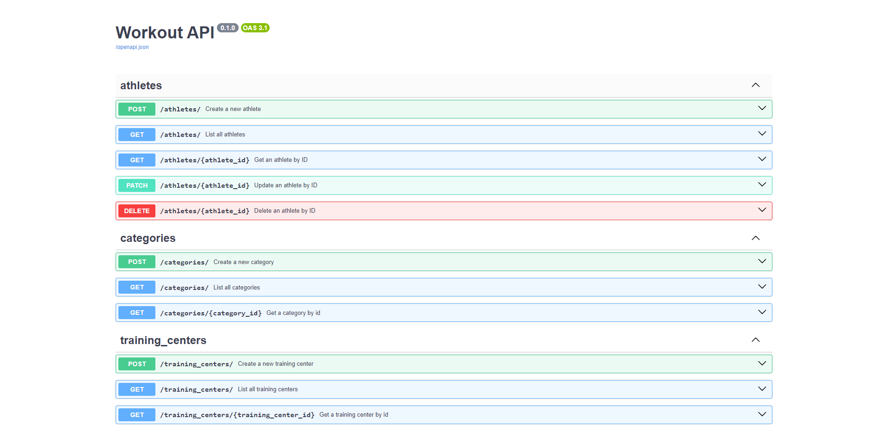

<p align="center">
    <a href="https://docs.python.org/3/">
        
    </a>
    <a href="https://fastapi.tiangolo.com/">
        
    </a>
    <a href="https://www.sqlalchemy.org/">
        
    </a>
    <a href="https://www.openapis.org/">
        
    </a>
    <a href="https://swagger.io/">
        
    </a>
    <a href="https://www.docker.com/">
        
    </a>
    <a href="https://www.postgresql.org/">
        
    </a>
    <a href="https://github.com/rafaelmachadobr/fastapi-workout-api/blob/main/LICENSE">
        
    </a>
</p>

# FastAPI Workout API

Este projeto é uma aplicação de API para gerenciar dados de treinos, construída com FastAPI e SQLAlchemy. A aplicação oferece funcionalidades para criar, ler, atualizar e deletar treinos e atletas, com suporte a migrações de banco de dados.

<details>
    <summary>Índice</summary>
    <ol>
        <li><a href="#sobre-o-projeto">Sobre o Projeto</a></li>
        <li><a href="#tecnologias-utilizadas">Tecnologias Utilizadas</a></li>
        <li><a href="#funcionalidades">Funcionalidades</a></li>
        <li><a href="#instalação">Instalação</a></li>
        <li><a href="#uso">Uso</a></li>
        <li><a href="#estrutura-do-projeto">Estrutura do Projeto</a></li>
        <li><a href="#rotas-da-api">Rotas da API</a></li>
        <li><a href="#modelos-de-dados">Modelos de Dados</a></li>
        <li><a href="#licença">Licença</a></li>
    </ol>
</details>

## Sobre o Projeto



O FastAPI Workout API é uma aplicação de gerenciamento de treinos desenvolvida com FastAPI, SQLAlchemy e Alembic. Este projeto visa fornecer uma solução completa para atletas gerenciarem seus treinos e perfis, com suporte a operações CRUD (Create, Read, Update, Delete). A estrutura modular do código facilita a adição de novas funcionalidades e a manutenção do sistema.

## Tecnologias Utilizadas

<ul>
  <li>
    <a href="https://www.python.org/">
      
    </a>
  </li>
  <li>
    <a href="https://fastapi.tiangolo.com/">
      
    </a>
  </li>
  <li>
    <a href="https://www.sqlalchemy.org/">
      
    </a>
  </li>
  <li>
    <a href="https://pydantic-docs.helpmanual.io/">
      
    </a>
  </li>
  <li>
    <a href="https://www.docker.com/">
      
    </a>
  </li>
  <li>
    <a href="https://docs.docker.com/compose/">
      
    </a>
  </li>
  <li>
    <a href="https://www.postgresql.org/">
      
    </a>
  </li>
  <li>
    <a href="https://swagger.io/tools/swagger-ui/">
      
    </a>
  </li>
</ul>

## Funcionalidades

- [x] _Gerenciamento de Atletas_: CRUD completo para atletas
- [x] _Gerenciamento de Treinos_: CRUD completo para treinos
- [x] _Migrações de Banco de Dados_: Utiliza Alembic para gerenciar mudanças no esquema do banco de dados.

## Instalação

Para instalar o projeto, siga os passos abaixo:

1. Clone o repositório:

```bash
git clone https://github.com/rafaelmachadobr/fastapi-workout-api.git
```

2. Acesse o diretório do projeto:

```bash
cd fastapi-workout-api
```

3. Instale as dependências do projeto:

```bash
pip install -r requirements.txt
```

4. Execute o comando `docker-compose up` para iniciar o projeto:

```bash
docker-compose up --build -d
```

5. Configure o banco de dados e execute as migrações:

```bash
make run-migrations
```

6. Inicie a aplicação:

```bash
make run
```

## Uso

Para usar a API, você pode acessar a documentação interativa fornecida pelo Swagger no endpoint /docs ou pelo ReDoc em /redoc.

## Estrutura do Projeto

A estrutura do projeto é organizada da seguinte forma:

```bash
fastapi-workout-api/
├── src/
│   ├── alembic/
│   │   ├── versions/
│   │   ├── env.py
│   │   ├── README
│   │   ├── script.py.mako
│   ├── athletes/
│   │   ├── __init__.py
│   │   ├── controller.py
│   │   ├── model.py
│   │   └── schemas.py
│   ├── categories/
│   │   ├── __init__.py
│   │   ├── controller.py
│   │   ├── model.py
│   │   └── schemas.py
│   ├── configs/
│   │   ├── __init__.py
│   │   ├── database.py
│   │   └── settings.py
│   ├── contrib/
│   │   ├── repository/
│   │   │   ├── __init__.py
│   │   │   └── models.py
│   │   ├── __init__.py
│   │   ├── dependencies.py
│   │   ├── models.py
│   │   └── schemas.py
│   ├── training_centers/
│   │   ├── __init__.py
│   │   ├── controller.py
│   │   ├── model.py
│   │   └── schemas.py
│   ├── main.py
│   └── routers.py
├── .gitignore
├── alembic.ini
├── docker-compose.yml
├── LICENSE
├── Makefile
├── README.md
└── requirements.txt
```

## Rotas da API

A API possui as seguintes rotas:

### Atletas

- `GET /athletes/`: Retorna uma lista de todos os atletas cadastrados.
- `GET /athletes/{athlete_id}`: Retorna um atleta específico.
- `POST /athletes/`: Cria um novo atleta.
- `PUT /athletes/{athlete_id}`: Atualiza um atleta existente.
- `DELETE /athletes/{athlete_id}`: Deleta um atleta existente.

### Treinos

- `GET /training_centers/`: Retorna uma lista de todos os treinos cadastrados.
- `GET /training_centers/{training_center_id}`: Retorna um treino específico.
- `POST /training_centers/`: Cria um novo treino.
- `PUT /training_centers/{training_center_id}`: Atualiza um treino existente.
- `DELETE /training_centers/{training_center_id}`: Deleta um treino existente.

### Categorias

- `GET /categories/`: Retorna uma lista de todas as categorias cadastradas.
- `GET /categories/{category_id}`: Retorna uma categoria específica.
- `POST /categories/`: Cria uma nova categoria.
- `PUT /categories/{category_id}`: Atualiza uma categoria existente.
- `DELETE /categories/{category_id}`: Deleta uma categoria existente.

## Modelos de Dados

A API possui os seguintes modelos de dados:

### Atleta

```python
class AthleteModel(BaseModel):
    __tablename__ = 'athletes'

    pk_id: Mapped[int] = mapped_column(Integer, primary_key=True)
    name: Mapped[str] = mapped_column(String(50), nullable=False)
    cpf: Mapped[str] = mapped_column(String(11), unique=True, nullable=False)
    birth_date: Mapped[date] = mapped_column(Date, nullable=False)
    weight: Mapped[float] = mapped_column(Float, nullable=False)
    height: Mapped[float] = mapped_column(Float, nullable=False)
    sex: Mapped[str] = mapped_column(String(1), nullable=False)
    created_at: Mapped[datetime] = mapped_column(
        DateTime, default=datetime.now)
    updated_at: Mapped[datetime] = mapped_column(
        DateTime, default=datetime.now, onupdate=datetime.now)
    category: Mapped["CategoryModel"] = relationship(
        back_populates="athletes", lazy='selectin')
    category_id: Mapped[int] = mapped_column(ForeignKey("categories.pk_id"))
    training_center: Mapped["TrainingCenterModel"] = relationship(
        back_populates="athletes", lazy='selectin')
    training_center_id: Mapped[int] = mapped_column(
        ForeignKey("training_centers.pk_id"))
```

### Centro de Treinamento

```python
class TrainingCenterModel(BaseModel):
    __tablename__ = 'training_centers'

    pk_id: Mapped[int] = mapped_column(Integer, primary_key=True)
    name: Mapped[str] = mapped_column(String(20), unique=True, nullable=False)
    address: Mapped[str] = mapped_column(String(60), nullable=False)
    owner: Mapped[str] = mapped_column(String(30), nullable=False)
    created_at: Mapped[datetime] = mapped_column(
        DateTime, default=datetime.now)
    updated_at: Mapped[datetime] = mapped_column(
        DateTime, default=datetime.now, onupdate=datetime.now)
    athletes: Mapped["AthleteModel"] = relationship(
        back_populates="training_center")
```

### Categoria

```python
class CategoryModel(BaseModel):
    __tablename__ = 'categories'

    pk_id: Mapped[int] = mapped_column(Integer, primary_key=True)
    name: Mapped[str] = mapped_column(String(10), unique=True, nullable=False)
    created_at: Mapped[datetime] = mapped_column(
        DateTime, default=datetime.now)
    updated_at: Mapped[datetime] = mapped_column(
        DateTime, default=datetime.now, onupdate=datetime.now)
    athletes: Mapped["AthleteModel"] = relationship(back_populates="category")
```

## Licença

Este projeto está licenciado sob a licença MIT. Consulte o arquivo [LICENSE](LICENSE) para obter mais informações.
